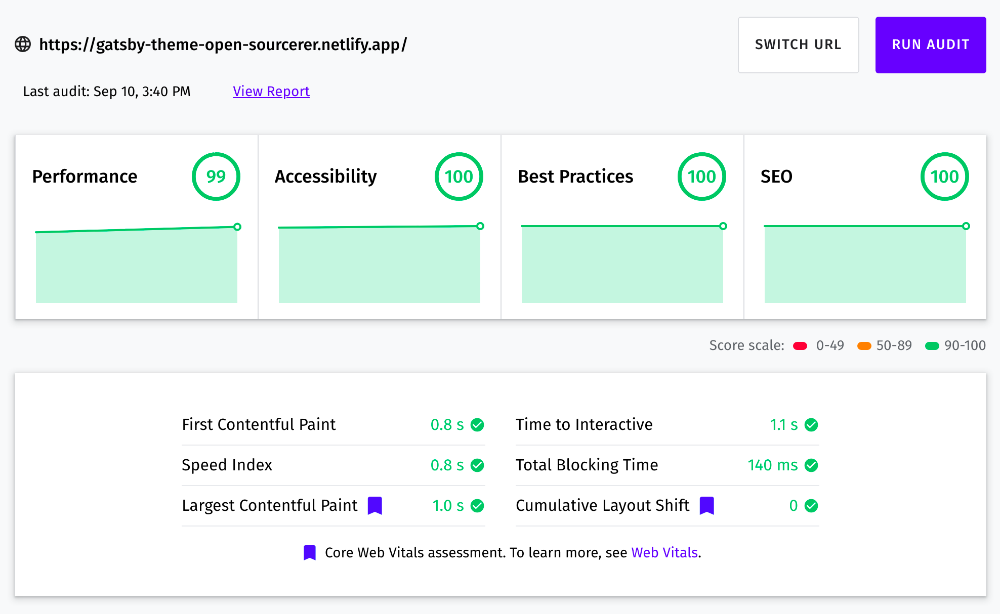

# gatsby-theme-open-sourcerer

A configurable and performant minimal gatsby portfolio theme for open source developers.

### [Live Demo](https://gatsby-theme-open-sourcerer.netlify.app/)


## Installing the theme

1. Create a site

You can easily bootstrap a site by using the [starter theme](https://github.com/sh4hids/gatsby-starter-open-sourcerer). For this, you have to have [gatsby-cli](https://www.gatsbyjs.com/docs/tutorial/part-0/#gatsby-cli) installed. Now run the following command:

```bash
gatsby new my-site https://github.com/sh4hids/gatsby-starter-open-sourcerer
```

2. Start development server

After installation process has finished, nevigate to the project and run the following command:

```bash
cd my-site
gatsby develop
```

3. See the theme in action

Open `http://localhost:8000` in your browser to see your site in action or visit `http://localhost:8000/___graphql` to check the graphql playground.

4. Start hacking

Open the current directory in your favorite code editor and start hacking the theme.

**NB** All the available commands can be found [here](https://github.com/sh4hids/gatsby-starter-open-sourcerer/blob/main/package.json).

## Customizing default configuration

You can provide necessary configuration via plugin options on `gatsby-config.js`. Copy the default configuration from [here](https://github.com/sh4hids/gatsby-theme-open-sourcerer/blob/main/src/config/index.js) and customize as you need. If you bootstrapped your site by using the starter kit, you just have to customize the `my-site/src/config/index.js` file.

## Component shadowing

If you want to customize a component, you can use [theme shadowing](https://www.gatsbyjs.com/docs/how-to/plugins-and-themes/shadowing/). Create the following directories in your src folder:

```
├── src
│   ├── @sh4hids
│   │   └── gatsby-theme-open-sourcerer
```

For example, if you want to shadow the `BrandLogo` component, your directory structure will be like this:

```
├── src
│   ├── @sh4hids
│   │   └── gatsby-theme-open-sourcerer
│   │       └── components
│   │           ├── BrandLogo.js
```

You can shadow any component you like by following the above structure. All the components can be found in `src` dorectory of this repo.

**N.B.** You might get some error while shadowing a component. This might happen if copy/paste components from this theme's `src` folder. One of the error might be:

```
Module not found: Error: Can't resolve '../components' in
```

In the above case, check if there's any relative import. If there's any, refactor the `imports` like this:

```javascript
import { Text } from '@sh4hids/gatsby-theme-open-sourcerer/src/components';
import { DefaultLayout } from '@sh4hids/gatsby-theme-open-sourcerer/src/layouts';
```

## Writing posts

You can write blog post using `markdown` file format. Just follow this structure:

```
// contents/blog/your-post.md

---
title: My Awesome Post
slug: my-awesome-post
publishedAt: 2021-07-30
isPublished: true
tags:
  - test
  - web dev
---

Your post will go here...
```

**NB: If you want to make draft post, set `isPublished` to `false` in post's frontmatter. You can use [this script](https://github.com/sh4hids/shahid.pro/blob/main/scripts/create-post.js) to automate the process.**

## Customizing pages

Contents for the following pages are required for this theme to work properly. You have to provide the contents in `.yml` format in your contents folder.

- Projects ([content structure](https://github.com/sh4hids/gatsby-theme-open-sourcerer/blob/main/contents/projects.yml))
- Uses ([content structure](https://github.com/sh4hids/gatsby-theme-open-sourcerer/blob/main/contents/uses.yml))

### Customizing About/Contact page

Create files named `About.js`/`Contact.js` in the following directory:

```
├── src
│   ├── @sh4hids
│   │   ├── gatsby-theme-open-sourcerer
│   │   │   ├── templates
│   │   │   │   ├── About.js
│   │   │   │   ├── Contact.js
```

#### Page layout

Copy the base layout for each of the pages from the following links and customize as you like.

- [About](https://github.com/sh4hids/gatsby-theme-open-sourcerer/blob/main/src/templates/About.js)
- [Contact](https://github.com/sh4hids/gatsby-theme-open-sourcerer/blob/main/src/templates/Contact.js)

## Using built-in components

You can import and use any components from the source folder. Some of the default components directories are:

- [components](https://github.com/sh4hids/gatsby-theme-open-sourcerer/tree/main/src/components)
- [layouts](https://github.com/sh4hids/gatsby-theme-open-sourcerer/tree/main/src/layouts)
- [themes](https://github.com/sh4hids/gatsby-theme-open-sourcerer/tree/main/src/styles/themes)

Example:

```javascript
import { Box } from '@shahids/gatsby-theme-open-sourcerer/src/components';
```

## Performance



## Want to help?

If you want to help in any way to make the theme better, you are welcome. Some of the ways you can help are:

- Reporting an issue (bug)
- Improving the documentation (README)
- Adding your site to the showcase section

## Want to offer me a Cofee?

If you like the theme and want to buy me a coffee, please follow the link 👇

<a href="https://www.buymeacoffee.com/sh4hids" target="_blank"></a>

## Sites built with this theme

- [shahid.pro](https://shahid.pro)

## Related projects

- [gatsby-starter-open-sourcerer](https://github.com/sh4hids/gatsby-starter-open-sourcerer)
